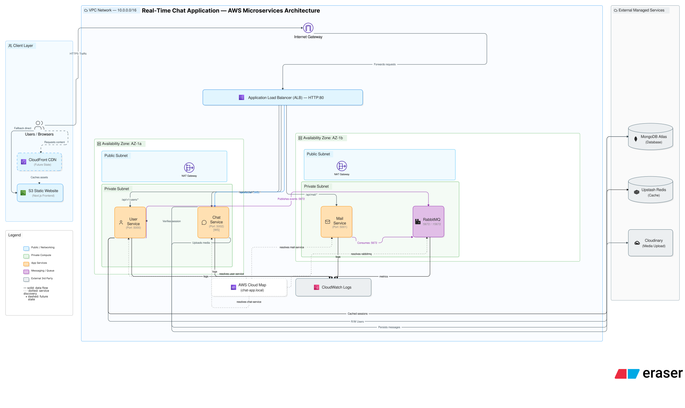

# Real-time Chat App — User Microservice

A real-time chat application built as three independent backend services (User, Chat, Mail) that communicate through a message broker, with a static frontend served from object storage. All backend services run as containers on serverless compute, discover each other through internal DNS, and sit behind a single load balancer that routes traffic by URL path. The deployment, scaling, and teardown of the entire infrastructure is handled through scripts rather than manual console configuration

This project is primarily focused on **backend architecture**, microservices communication, cloud infrastructure, and authentication systems rather than frontend development.

This is the **main microservice** responsible for user registration, login, JWT token generation (RS256), and profile management. It serves as the identity provider for the entire chat application.

## Demo Video

[Link](https://drive.google.com/file/d/1nCEl55y578Um9x72JDJ2i7dlEfIhdeV2/view?usp=sharing)
---

## Architecture Diagram



The complete application consists of 3 microservices (User, Chat, Mail) + RabbitMQ, all containerized and deployed on AWS ECS Fargate behind an Application Load Balancer. The frontend is a Next.js static site hosted on S3.

---

## Tech Stack

| Layer | Technology |
|-------|-----------|
| Runtime | Node.js 22 (Alpine) |
| Framework | Express.js 5.x |
| Language | TypeScript 6.x |
| Database | MongoDB Atlas |
| Cache | Upstash Redis |
| Message Broker | RabbitMQ (containerized in ECS) |
| Auth | JWT (RS256) with RSA key pair |
| Container | Docker multi-stage build |
| Cloud | AWS ECS Fargate, ALB, ECR, Cloud Map |

---

## Features

- **User Authentication** — Login with email, JWT token generation
- **Token Verification** — Verify user identity via JWT
- **Profile Management** — View and update user profile
- **User Discovery** — List all users, get specific user by ID
- **Session Caching** — Redis-backed session storage
- **Event Publishing** — Publishes login events to RabbitMQ for Mail service
- **Health Check** — `/api/v1/users/health` for ALB health checks

---

## API Endpoints

| Method | Endpoint | Description | Auth |
|--------|----------|-------------|------|
| POST | `/api/v1/users/login` | Login with email, returns JWT | No |
| POST | `/api/v1/users/verify` | Verify JWT token validity | No |
| GET | `/api/v1/users/me` | Get current user profile | Yes (JWT) |
| GET | `/api/v1/users/user/all` | List all registered users | Yes (JWT) |
| GET | `/api/v1/users/user/:id` | Get specific user by ID | No |
| POST | `/api/v1/users/update/user` | Update user name | Yes (JWT) |
| GET | `/api/v1/users/health` | Health check for ALB | No |

---

# Project Structure

```text
backend/user/
├── src/
│   ├── config/
│   │   ├── db.ts                    # MongoDB connection
│   │   ├── redis.ts                 # Upstash Redis client
│   │   ├── rabbitmq.ts              # RabbitMQ publisher
│   │   ├── generateToken.ts         # RS256 JWT signing
│   │   └── TryCatch.ts
│   │
│   ├── controllers/
│   │   └── user.ts                  # Route handlers
│   │
│   ├── integration-tests/
│   │   ├── login.integration.test.ts
│   │   ├── profile.integration.test.ts
│   │   ├── update-user.integration.test.ts
│   │   ├── user-all.integration.test.ts
│   │   ├── user-id.integration.test.ts
│   │   └── verify.integration.test.ts
│   │
│   ├── unit-tests/
│   │   ├── getAllUsers.test.ts
│   │   ├── getAUser.test.ts
│   │   ├── loginUser.test.ts
│   │   ├── myProfile.test.ts
│   │   ├── updateName.test.ts
│   │   └── verifyUser.test.ts
│   │
│   ├── interface/
│   │   └── interface_types.ts
│   │
│   ├── middleware/
│   │   └── isAuth.ts                # JWT verification middleware
│   │
│   ├── model/
│   │   └── User.ts                  # Mongoose schema
│   │
│   ├── script/
│   │   └── generate-keys.ts         # RSA key generation script
│   │
│   ├── routes/
│   │   └── user.ts                  # Express router
│   │
│   └── index.ts                     # Entry point
│
├── Dockerfile                       # Multi-stage production build
├── docker-compose.yml               # Local development stack
├── package.json
└── tsconfig.json
```
---
# Local Development (Docker Compose)

Run the entire local stack including RabbitMQ:

```bash
cd backend/user
docker-compose up --build
```

## Services

- **User Service:** `http://localhost:5000`
- **RabbitMQ Management UI:** `http://localhost:15672`
  - Username: `admin`
  - Password: `admin123`

---

# Environment Variables

Create a `.env` file inside `backend/user` and add the following:

```env
PORT=5000

MONGO_URI=your_mongodb_atlas_uri
REDIS_URL=your_upstash_redis_url

Rabbitmq_Host=localhost
Rabbitmq_Username=admin
Rabbitmq_Password=admin123

JWT_PRIVATE_KEY_BASE64=your_base64_private_key
JWT_PUBLIC_KEY_BASE64=your_base64_public_key
JWT_EXPIRES_IN=15d
```

---

# Infrastructure Management

Infrastructure is managed entirely via PowerShell scripts.

###### Prerequisites

Before running the scripts, ensure the following are installed and configured:

- AWS CLI configured with IAM user credentials
- Docker Desktop running
- PowerShell 5.1+

###### Scripts

| Script         | Purpose                                                                 |
|----------------|-------------------------------------------------------------------------|
| `create.ps1`   | Creates the entire AWS infrastructure (VPC, ALB, ECS, ECR, S3, Cloud Map) |
| `destroy.ps1`  | Destroys all AWS resources and stops billing                           |
| `diagnose.ps1` | Checks which resources exist and flags potential billing risks          |
| `aws-bill-scanner.ps1` | Checks which resources are causing bills          |

###### Deploy
1. Edit placeholder environment variables in create.ps1
2. Run from project root
```text
.\create.ps1
```
3. After creation, update frontend API URLs to the ALB DNS
4. Rebuild and upload frontend /out to S3 

---
# Related Repositories

| Repository | Description |
|------------|-------------|
| [**Real-time-Chat-App-User-Microservice**](https://github.com/Taha-Sayyed/Real-time-Chat-App-User-Microservice) | Authentication & user management (this repo) |
| [**Real-time-Chat-App-Chat-Microservice**](https://github.com/Taha-Sayyed/Real-time-Chat-App-Chat-Microservice) | Real-time messaging with Socket.IO |
| [**Real-time-Chat-App-Mail-Microservice**](https://github.com/Taha-Sayyed/Real-time-Chat-App-Mail-Microservice) | Email notifications via RabbitMQ |
| [**Real-time-Chat-App-Frontend**](https://github.com/Taha-Sayyed/Real-time-Chat-App-Frontend) | Next.js static frontend |
