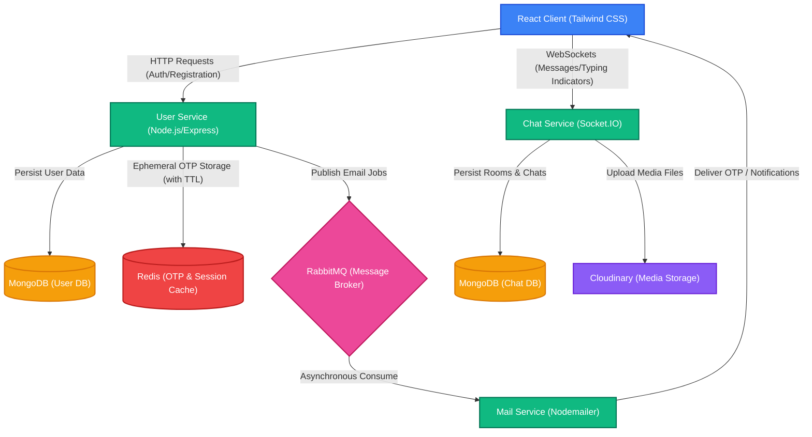

# 💬 Real-Time Microservices Chat Application

A scalable, production-ready, microservices-based real-time chat application built to demonstrate modular backend architecture, robust event-driven workflows, and efficient real-time communication.

---

## 🏗️ System Architecture

The application is built on a decoupled, microservices-oriented architecture designed to handle distinct domains independently. This separation ensures high availability, horizontal scalability, and ease of maintenance.

### 📊 Interactive Architecture Diagram



> [!NOTE]
> **Custom Architecture Diagram Placeholder**
> If you have a custom design or exported PNG of your architecture, replace the reference below:
> 
> 

---

## 🛠️ Technology Stack

| Layer | Technology | Purpose |
| :--- | :--- | :--- |
| **Frontend** | React.js | Dynamic, responsive user interface |
| | Tailwind CSS | Sleek, modern, utility-first styling |
| **Backend Core** | Node.js (Express.js) | Light, fast, modular REST APIs & controllers |
| | TypeScript | Complete type safety, compile-time checks, and clean interfaces |
| **Real-time** | Socket.IO | Persistent full-duplex WebSockets for instant events |
| **Message Broker**| RabbitMQ | Asynchronous inter-service communication and task queue |
| **Databases** | MongoDB | Primary persistent document store (User records & Chat History) |
| | Redis | High-speed caching, session persistence, and ephemeral OTP TTL storage |
| **Media Handling**| Cloudinary | Rich media processing, optimized image storage, and delivery |

---

## ✨ Salient Features

*   🔒 **Secure OTP Authentication:** Passwordless signup/login via email-based OTPs, secured through cryptographic validation and time-limited tokens.
*   ⚡ **Instant Real-Time Messaging:** Bidirectional, ultra-low latency chat powered by room-based Socket.IO pipelines.
*   ✍️ **Live Typing Indicators:** Instant feedback loops notifying rooms when participants are actively writing messages.
*   🖼️ **Optimized Rich Media Support:** Send and receive images or attachments seamlessly using optimized Cloudinary storage.
*   📈 **Scalable Independent Services:** A decoupled architecture where User, Chat, and Mail workloads are isolated for zero-downtime scaling.

---

## 🧠 Deep Engineering Principles

### 1. Asynchronous Processing & Queueing
To maximize API responsiveness, critical but slow tasks (such as dispatching email notifications) are offloaded to **RabbitMQ**. 
- The **User Service** publishes an event to a dedicated email queue upon registration.
- The **Mail Service** consumes events asynchronously and delivers the emails.
- **Benefit:** Eliminates request-blocking in the main HTTP request-response cycle, ensuring extremely fast registration response times (~milliseconds) and high system throughput.

### 2. Ephemeral State Management with Redis TTL
One-Time Passwords (OTPs) require short lifetimes to prevent replay attacks.
- Instead of polluting the primary relational/document database with short-lived codes, OTPs are stored in **Redis**.
- A predefined **TTL (Time-To-Live)** is associated with each cache key.
- **Benefit:** Redis automatically purges expired codes, completely eliminating the need for periodic DB cleanup cron-jobs and drastically lowering MongoDB write operations.

### 3. Room-Based Event Partitioning (Socket.IO)
To maintain performance during concurrent user surges, standard broadcasting is avoided.
- Client sessions are automatically assigned to specific `ChatIDs` utilizing **Socket.IO Rooms**.
- Message payloads, typing events, and read receipts are only emitted to active members of that specific room.
- **Benefit:** Minimizes unnecessary network overhead, limits the blast radius of event emissions, and optimizes battery/data usage on client devices.

### 4. Zero-Data-Loss Durability (RabbitMQ Message Acknowledgment)
Mail service downtimes or third-party email API limits could lead to lost OTP codes.
- The queue configuration employs durable queues and explicit message acknowledgments (`ack`).
- If the Mail Service crashes mid-execution, RabbitMQ detects the channel closure and automatically re-queues the task.
- **Benefit:** Guaranteed message delivery and robust fault tolerance.

### 5. Type-Safe Contract Enforcement
Utilizing **TypeScript** across the entire microservices ecosystem.
- Interface schemas are shared across services to ensure that published payload contracts match consumer assumptions.
- **Benefit:** Reduces run-time errors and speeds up local collaborative development.

---

## 🚀 Getting Started

### Prerequisites
Before running the application locally, ensure you have the following installed:
*   [Node.js](https://nodejs.org/) (v16+)
*   [Docker](https://www.docker.com/) (highly recommended for running database services)

### Running Services Locally

1.  **Spin up Core Databases and Message Broker:**
    ```bash
    docker run -d --name chat-mongodb -p 27017:27017 mongo
    docker run -d --name chat-redis -p 6379:6379 redis
    docker run -d --name chat-rabbitmq -p 5672:5672 -p 15672:15672 rabbitmq:3-management
    ```

2.  **Configure Environment Variables:**
    Create a `.env` file in the root of the services:
    ```env
    PORT=5001
    MONGO_URI=mongodb://localhost:27017/chat-user
    REDIS_URL=redis://localhost:6379
    RABBITMQ_URL=amqp://localhost:5672
    JWT_SECRET=your_super_secret_jwt_key
    ```

3.  **Install & Run User Service:**
    ```bash
    cd backend/user
    npm install
    npm run dev
    ```

---

## 📄 License

This project is licensed under the ISC License. See the [package.json](package.json) file for details.
